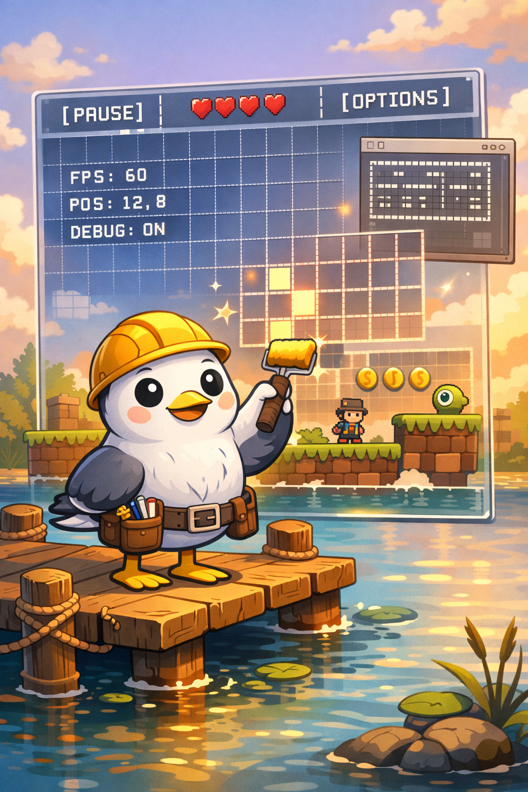

# CGUL (Seagull)




**CGUL** (pronounced **“Seagull”**) is a **Glyph UI Layout** standard: UI represented as a **monospace glyph grid** (cells) so the same UI semantics can be rendered as a clean **ASCII / glyph-based view** for developer mode, reduced sensory load, accessibility, and debugging.

CGUL’s core promise:

- **One UI meaning** (widgets, state, focus, layout)
- **Multiple renderers** (pixel UI, glyph UI, engine overlays)
- **Portable adapters** (game engines, C++ apps, VST UIs, and beyond)

README media note: store images & GIFs in `.github/assets/readme/` and reference them using relative paths.

---

## Why CGUL exists

Modern UI stacks are powerful, but they’re often hard to debug and hard to simplify. CGUL provides a **semantic UI snapshot** as a **glyph grid**, making it easy to:

- Inspect UI layout at a glance (even headless / low-distraction modes)
- Add deterministic dev overlays you can test and replay
- Export frames for regression tests and tooling
- Provide an alternate UI view without rewriting the whole UI

---

## Working domains

### 🎮 Game engine UI
Debug overlays, dev menus, inspectors, HUD, and in-engine tools — represented as glyph cells.

### 🖥️ C++ app UI
Panels, settings screens, lists, and utilities with a consistent grid model.

### 🎛️ VST UI
Plugin panels, modulation views, and parameter debugging with an optional low-distraction “glyph view”.

---

## Quick start (terminal POC)

Build and run:

```bash
cmake -S . -B build -G Ninja -DCMAKE_BUILD_TYPE=Debug
cmake --build build
./build/cgul_cli
````

Hit-test a cell:

```bash
./build/cgul_cli --hover 10 10
```

Export a frame (v0 JSON):

```bash
./build/cgul_cli --dump-json > cgul_frame.json
```

---

## Project structure

* `include/cgul/` — public headers (CGUL core types)
* `src/` — core implementation
* `apps/cgul_cli/` — minimal CLI renderer + examples
* `.github/assets/readme/` — README images and GIFs

---

## Core concepts (v0)

* **Frame**: 2D grid of cells (width × height)
* **Cell**: glyph + style + metadata (e.g., `widgetId`)
* **Hit testing**: cursor → cell → widget id
* **Export**: serialize frames for inspection and tooling

Design rule:

* `cgul-core` stays **engine-agnostic** (no SFML, no Godot types)
* Engine specifics live behind adapters (SFML adapter, Godot adapter, etc.)

---

## Roadmap

* **v0 (current):** cgul-core + terminal renderer, hit testing, frame export
* **v1:** SFML glyph-grid viewer (atlas + batched quads), mouse mapping, overlays
* **v2:** richer widget semantics (buttons, sliders, lists), focus & navigation
* **v3:** Godot adapter path (JSON import + renderer first, then GDExtension)

---

## License

MIT
