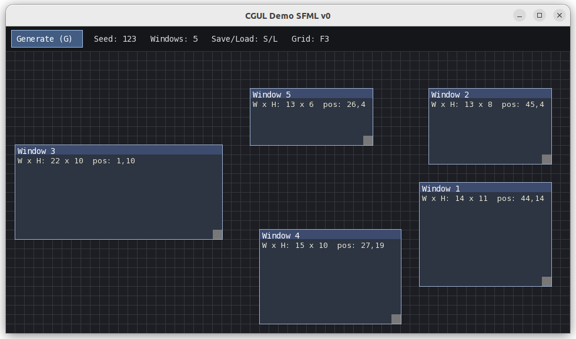

# CGUL (Seagull)

<div style="display:flex; gap:16px; align-items:flex-start;">
  
  <div>

**CGUL** is a **Glyph UI Layout** standard and C++ toolkit for representing UI as a **monospace cell grid** (glyphs).  

The goal is simple:

**One UI meaning → multiple renderers.**  
Build UI once, then render it as pixels *or* as a clean glyph view for developer mode, accessibility, low-motion options, headless inspection, and debugging.

CGUL is intentionally **portable**:
- **`cgul-core` is engine-agnostic** (no SFML/SDL/ImGui/Qt/Godot types)
- UI frameworks integrate via **thin adapters**
- `.cgul` files provide a stable interchange format you can load/save/replay

  </div>
</div>

---

<div style="display:flex; gap:16px; align-items:flex-start; justify-content:space-between;">
  <div style="flex:1;">

## Why CGUL exists

Modern UI stacks are powerful—but they’re often difficult to:
- inspect quickly,
- snapshot deterministically,
- test and replay,
- or simplify for low-distraction / reduced motion workflows.

CGUL adds a **semantic, deterministic representation** of UI that is:
- **diff-friendly** (`.cgul` JSON subset, stable formatting),
- **replayable** (seeded generation + exact bounds),
- **testable** (round-trip + validation smoke tests),
- and **renderer-agnostic** (pixel UI today, glyph UI tomorrow, engine overlays later).
  </div>
  
</div>

---

## What’s in this repo

### ✅ CGUL v0.1 standard seed
- `docs/spec.md` — semantic model (what the data *means*)
- `docs/format_cgul.md` — `.cgul` file format (what the bytes *look like*)
- `schemas/examples/` — example `.cgul` documents
- `include/cgul/` + `src/` — portable core + IO + validation + rendering helpers

### ✅ Tools
- `cgul_cli` — terminal renderer + `.cgul` save/load + hit-test + JSON frame dump
- `cgul_smoke` — round-trip regression tests for every example under `schemas/examples/`

### ✅ Flagship demo (SFML 3)
- `cgul_demo_sfml` — deterministic UI generator + editor:
  - generate random window layouts from a seed
  - drag to move, resize with a handle
  - validation-gated edits (invalid overlaps/out-of-bounds are rejected)
  - save/load `.cgul` with round-trip equality verification

---

## CGUL Demo (SFML v0)



This is the current “CGUL in action” reference app: **generate → edit → save/load** a `.cgul` layout with deterministic behavior.

Controls:
- `G` / **Generate** button: create a new deterministic layout
- Drag **title bar**: move window (snaps to cell grid)
- Drag **bottom-right handle**: resize window (snaps to cell grid)
- `S`: save to `demo_layout.cgul`
- `L`: load from `demo_layout.cgul`
- `F3`: toggle grid
- `+` / `-`: increase / decrease window count

Details: `docs/demo_app.md`

---

## Quick start

### Build (core tools + tests)

```bash
cd cgul
cmake -S . -B build -G Ninja -DCMAKE_BUILD_TYPE=Debug
cmake --build build
````

Run the CLI:

```bash
./build/cgul_cli
```

Load an example `.cgul` and render it in the terminal:

```bash
./build/cgul_cli --load-cgul schemas/examples/v0_1_windows.cgul
```

Hit-test a cell:

```bash
./build/cgul_cli --load-cgul schemas/examples/v0_1_windows.cgul --hover 10 10
```

Dump the composed frame as JSON (for inspection/tooling):

```bash
./build/cgul_cli --load-cgul schemas/examples/v0_1_windows.cgul --dump-json > /tmp/cgul_frame.json
```

### Run tests (enforce format stability)

Smoke tests (round-trip every `schemas/examples/*.cgul`):

```bash
./build/cgul_smoke
```

If you built with CTest enabled:

```bash
cd build
ctest --output-on-failure
```

### Build + run the SFML demo

```bash
cmake -S . -B build -G Ninja -DCMAKE_BUILD_TYPE=Debug -DCGUL_BUILD_SFML_DEMO=ON
cmake --build build
./build/cgul_demo_sfml --seed 123
```

Non-interactive save/load verification:

```bash
./build/cgul_demo_sfml --seed 123 --save /tmp/demo_layout.cgul --exit-after-startup
./build/cgul_demo_sfml --load /tmp/demo_layout.cgul --exit-after-startup
```

---

## SFML 3 (Ubuntu 22.04 notes)

The demo pulls **SFML 3.0.2 via CMake FetchContent** (no global install required), but SFML still needs common Linux dev libraries.

If you hit missing-package errors while configuring SFML, install:

```bash
sudo apt update
sudo apt install -y \
  libxrandr-dev libxcursor-dev libxi-dev libudev-dev \
  libfreetype-dev libflac-dev libvorbis-dev \
  libgl1-mesa-dev libegl1-mesa-dev
```

Optional (only if configure complains about them):

```bash
sudo apt install -y libharfbuzz-dev libmbedtls-dev
```

---

## Core concepts

### Semantic model (`CgulDocument`)

A `.cgul` file describes a UI layout in **cell units**, not pixels:

* grid dimensions (w/h in cells)
* widget list with stable ids, kind, bounds, title
* optional seed metadata for reproducible generation

### Frame (`cgul::Frame`)

A `Frame` is a **render-target model**: a 2D array of cells.
Each cell can contain:

* a glyph
* style metadata (fg/bg/flags)
* a `widgetId` for hit-testing and tooling

### Determinism + stability

This repo treats the file format as a contract:

* stable writer formatting
* validation rules (bounds, ids, overlap constraints)
* round-trip tests to prevent silent breaking changes

---

## Project structure

```
cgul/
├── include/cgul/            # public headers (portable)
├── src/                     # implementation
├── apps/
│   ├── cgul_cli/            # terminal tool
│   └── cgul_demo_sfml/      # SFML demo app
├── schemas/examples/        # example .cgul files (used by tests)
├── docs/                    # spec + format + integration notes
└── .github/assets/readme/   # README media
```

**Design rule:** core stays portable; UI frameworks live at the edges.

---

## License

This project is licensed under the terms of the [MIT License](LICENSE.md).

---

© 2026 Mary-Tyler-Moore
